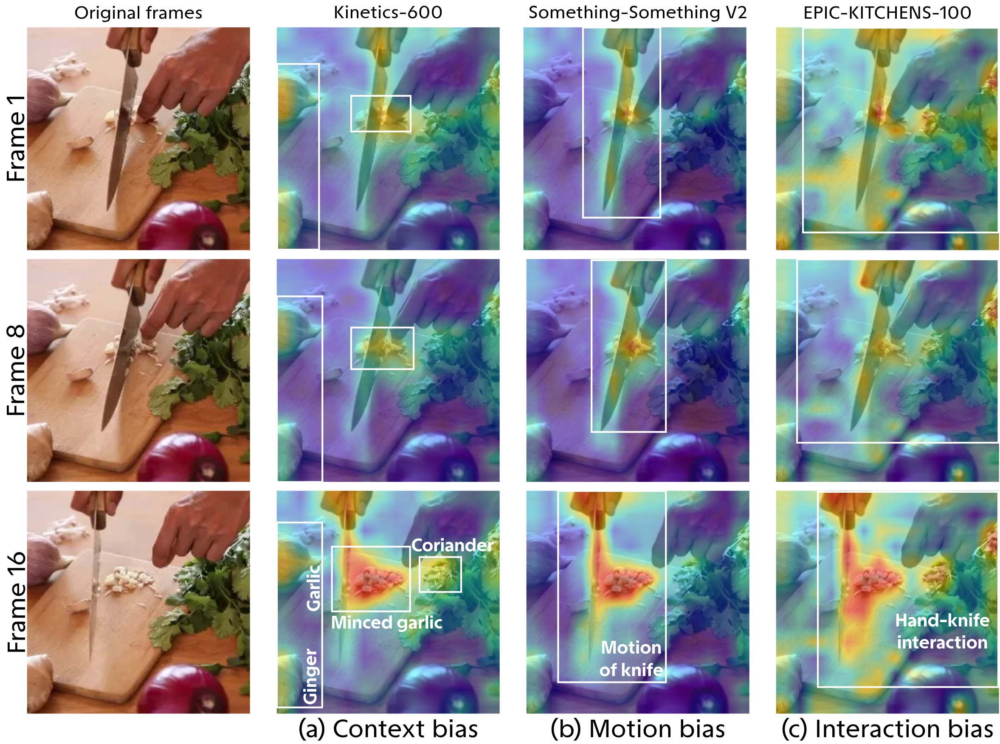
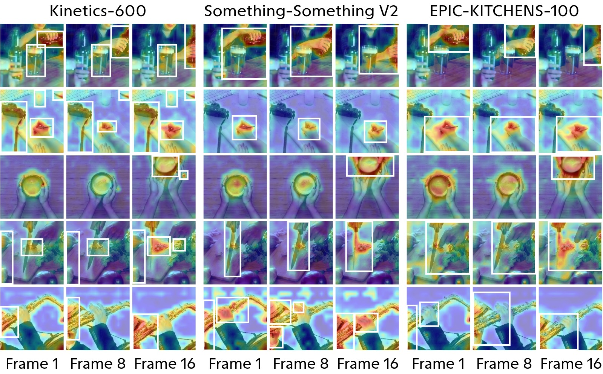
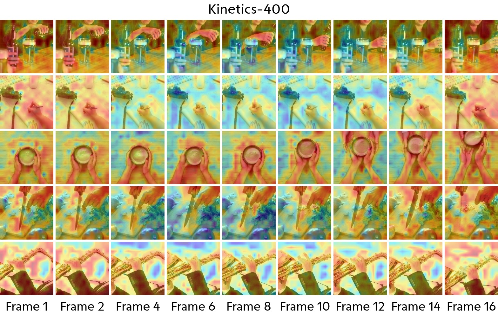
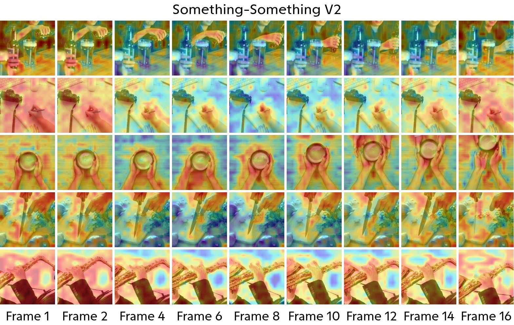
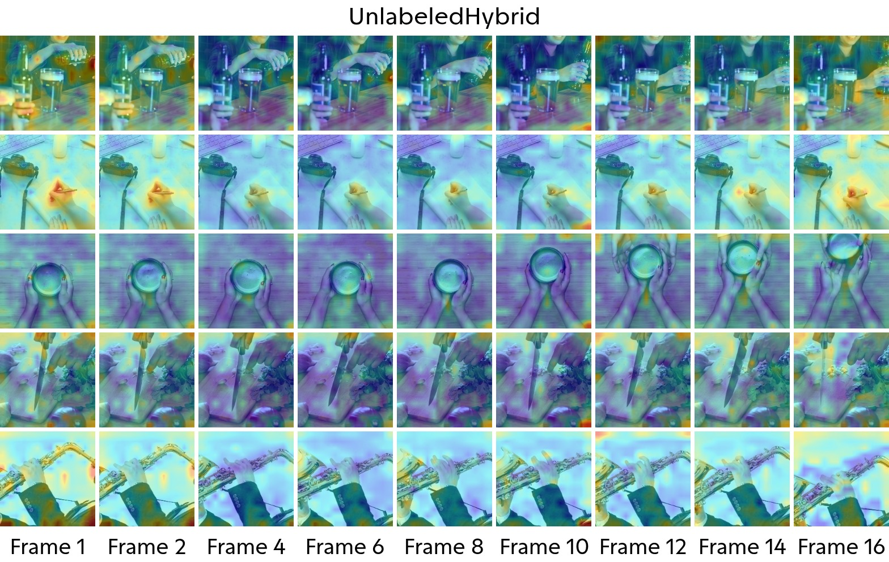

# website

## Abstract

Research in video understanding has advanced
rapidly, driven by increasingly diverse datasets and more powerful model architectures. While existing surveys typically organize
progress by tasks, benchmarks, or model families, they provide
limited insight into why particular architectures emerged and
succeeded. In this survey, we argue that the evolution of video understanding is fundamentally shaped by dataset structure. Properties such as motion complexity, temporal span, compositional
hierarchy, multi-agent interactions, and multimodal richness
impose distinct learning challenges and reasoning requirements
on models. We present a dataset-centric perspective that connects
dataset structure, inductive biases, and architectural design
within a unified framework. We show that different datasets
require models to capture specific invariances and capabilities,
such as robustness to viewpoint changes, sensitivity to temporal
ordering, reasoning over long-range dependencies, relational
interactions, and cross-modal alignment. These requirements naturally give rise to inductive biases, i.e., architectural assumptions
that favor particular patterns of reasoning and generalization.
From this perspective, milestone architectures, including twostream networks, 3D CNNs, temporal models, transformers,
graph-based methods, and multimodal foundation models, can be
understood as architectural responses to the challenges posed by
evolving datasets. Building on this framework, we systematically
analyze how dataset characteristics have shaped architectural
innovation across video understanding tasks and discuss the
representational biases induced by different data regimes. We
further provide practical guidance for aligning model design
with dataset properties and task requirements. By unifying
datasets, inductive biases, and architectures into a coherent
perspective, this survey offers both a retrospective explanation
of the field’s evolution and a forward-looking roadmap toward
general-purpose video understanding systems.

(any way make it shorter, but keep the main idea)

## Image Captions Pair

### Figure 1.

Dataset-induced representational biases. DAAM [16]
visualizations of MotionFormer [17] pretrained on different
datasets. (a) Kinetics-600 exhibits a context bias, attending to
surrounding objects, including the ginger, garlic, and coriander; (b) Something-Something V2 exhibits a motion bias, emphasizing the knife’s motion trajectory during cutting; and (c)
EPIC-KITCHENS-100 exhibits an interaction bias, focusing
on the hand-knife interaction and object manipulation. These
distinct attention patterns suggest that different pretraining
datasets induce different representational biases, even under
the same architecture. Video frames are from OWM [18].

### Figure 2.

Fig. 2: Attention visualizations of representative video models pretrained on different datasets and evaluated on the same video.
Dataset-specific attention patterns are consistently observed, although their strength varies across architectures.

### TL;DR

TL;DR: This paper argues that video understanding models evolve in response to dataset structure, not just better architecture design.